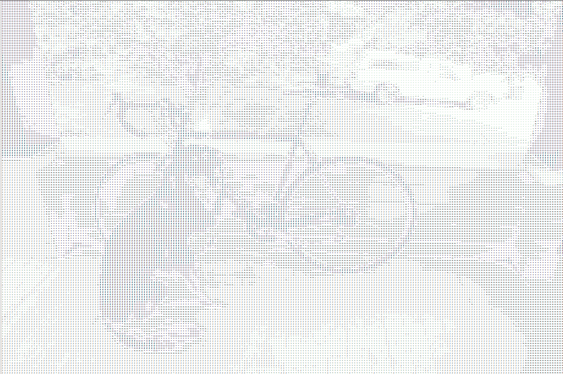
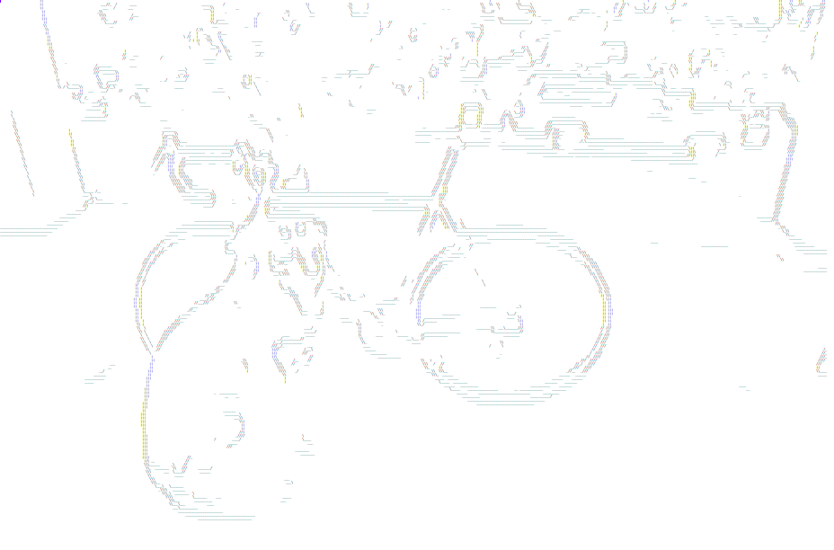
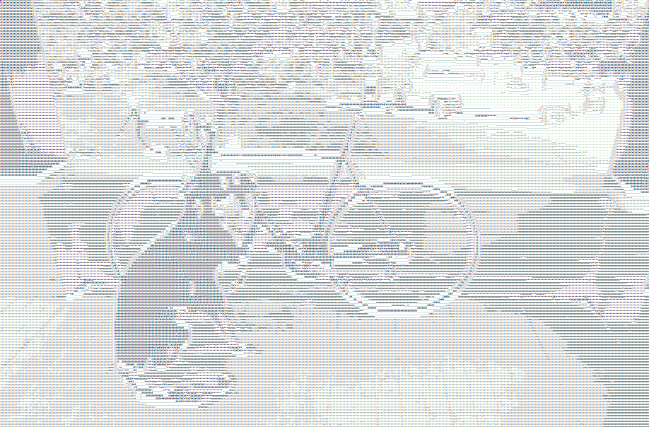

# Image to ASCII: Displaying Images without a GUI
### Computer Vision Final Project built by Adam Wang and Kai Nylund

---
## Overview:
This project explores converting images and live video into ASCII. This allows for images and videos to be displayed without a GUI, for example, in Command Prompt.

We had a few checkpoints for this project.

- `simple_ascii.py`: Maps brightness of grayscale image to ascii values ranging from characters such as '@' to '&nbsp; ', where lower brightness maps to "larger" characters.
- `simple_live.py` : Perform "live conversions" using camera input.
- `dog_sobel.py`: Adds edge detection using a Sobel filter and replacing the edges with symbols /\\|_— based on gradient angle. In `combine.py`, combines the simple ASCII conversion with the edges.
- 
- Make ASCII conversion more more realistic/ smoother

---
## Details:
We mainly used the OpenCV library to perform tasks such as resizing and video capture. For edge detection, we used the idea of Sobel filters from Homework 2, but used the built in OpenCV function instead. We used SciPy to map the max pixel values to the number of characters we were using. We used the os library in python to set the terminal size for optimal viewing of live version.

We used Joeseph Redmons dog photo to test our still conversions :D

---

## Summary:
Since ASCII text is taller than it is wide, we scaled the width and height of the images/ video frames differently so the ASCII image would look more proportional.

We found that when doing `dog_image.py`, using too many characters to convert into the ASCII image created a muddled image because small differences in the brightness would cause a different character to be used. We ended up using ~9 character encodings.

One of the issues with live conversions is that the ASCII is text, not an image, and to display it we have to write to a file as opposed to showing the image. We used Notepad ++ and it prompted us to refesh every time for a 'updated' frame, so it was more of a camera snapshot than a live ASCII video. 

Nevertheless it was cool seeing almost live ASCII images. 

Here are some of the results!

Simple 'Live' Conversion (Adam + Roommates + Cat):

Simple Pixel Conversion of dog:

Sobel Edge Conversion of dog:

Combined image of Edges + ASCII Conversion of dog:

---

## Next Steps:
