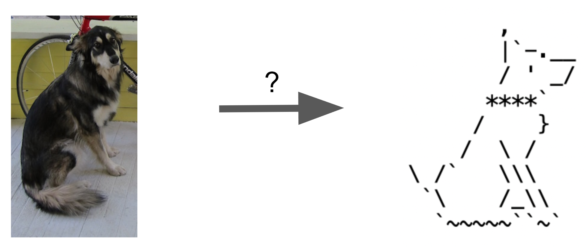
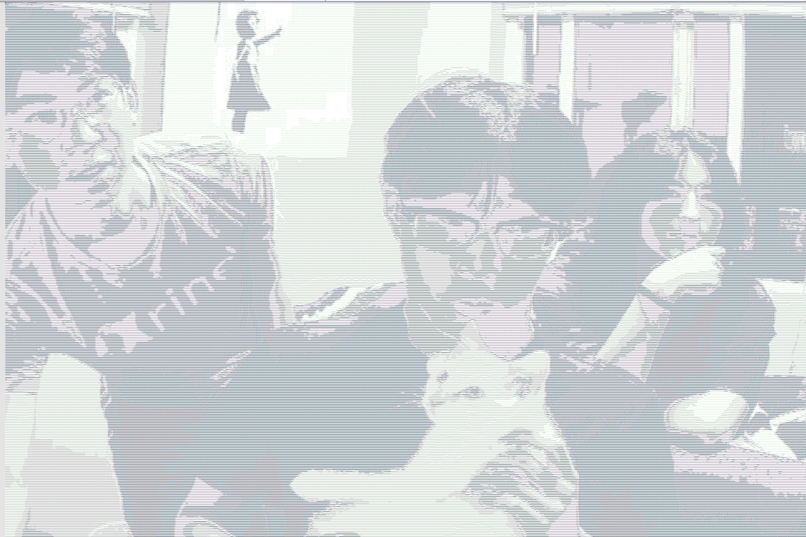
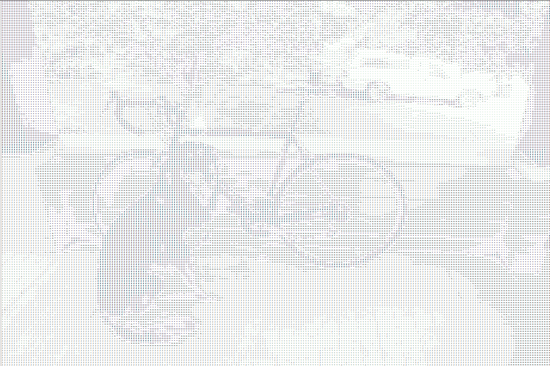
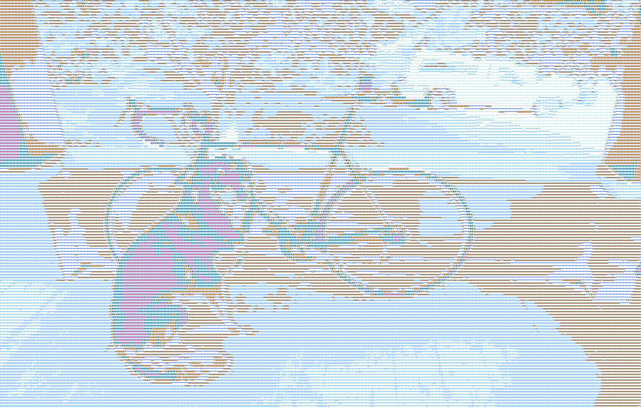

# Video to ASCII: Displaying Live Video without a GUI
### Computer Vision (CSE455) Final Project built by Adam Wang and Kai Nylund

---
## Problem Description:
This project explores converting images and live video into ASCII. This allows for images and videos to be displayed without a GUI, for example, in Command Prompt. We wanted to make the features stand out while also making the computations fast.

---
## Approach:
We implemented our ASCII conversion in several steps:

- `ascii_shading_mapping`: Maps pixels of an image directly to ascii characters from dark to light (e.g., " .\':;o*O#@") based on their grayscale value.
- `ascii_edge_mapping`: Maps the edges in an image to a limited set of ascii characters (e.g., "|/—\") based on their direction. We found edge magnitude and directions using a sobel filter.

Then, we display the ascii edges over the ascii shading to create our final image. Using this process, we convert camera input into a live ascii terminal output in `combined_live.py`.

---
## Details and Resources Used:
We mainly used the OpenCV library to perform tasks such as resizing and video capture. For edge detection, we used the idea of Sobel filters from Homework 2, but used the built in OpenCV function instead. We used SciPy to map the max pixel values to the number of characters we were using. We used the os library in python to set the terminal size for optimal viewing of the combined live version (for Windows).

We used Joeseph Redmons dog photo as well as other images to test our conversions (can be found in `img/test_imgs`).

Process of how it works: We resize the image/ camera input because the original files would create ASCII images that were too large. We then mapped the range of brightness values to the character encodings we used. However, this would make the edges unclear so we wanted to map the edges to representative characters (slashes, dashes, vertical lines, etc). We used Sobel filters to do this. We convert the edges of the image into their more accurate character encodings, and overlayed the result with our general ASCII image, creating the combined results in `combined_live.py`.

---

## Summary:
Since ASCII text is taller than it is wide, we scaled the width and height of the images/ video frames differently so the ASCII image would look more proportional.

We found that when doing live conversions based on camera input, using too many characters to convert into the ASCII image created muddled images because small differences in  brightness would cause a different character to be used. We ended up using ~14 shading character encodings.

One of the issues with live conversions is that the ASCII is text, not an image, and to display it we have to write to a file as opposed to showing the image. We used Notepad ++ and it prompted us to refesh every time for a 'updated' frame, so it was more of a camera snapshot than a live ASCII video. How we fixed this was printing the ASCII as a string to the terminal, and fixing the terminal size so that it would display correctly.

---
## Results:

Simple 'Live' Conversion (Adam + Roommates + Cat):

Simple Pixel Conversion of dog:

Sobel Edge Conversion of dog:

Combined image of Edges + ASCII Conversion of dog:

Live Demo Video:
https://user-images.githubusercontent.com/55294835/172263666-38a6daac-11f4-4a50-8d17-40976569046e.mp4

---
## Video:
https://youtu.be/rKsnCe0fgdY
---

## Next Steps:
After resizing out input, we are doing an almost pixel by pixel conversion to ASCII characters. It would be interesting building some network or model that would be able to smooth the images, especially when capturing live video.

--- 

## References:
https://towardsdatascience.com/convert-pictures-to-ascii-art-ece89582d65b

https://www.geeksforgeeks.org/add-image-to-a-live-camera-feed-using-opencv-python/
