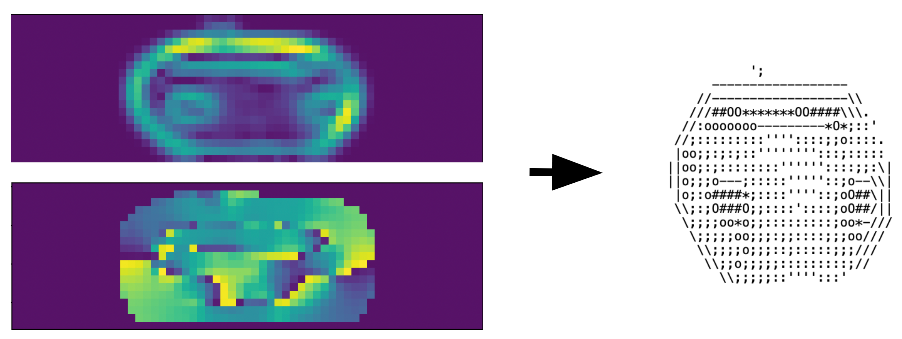

# Img to ASCII: Displaying Images and Live Video without a GUI
### Computer Vision (CSE455) Final Project built by Adam Wang and Kai Nylund

## Video Presentation:
https://youtu.be/rKsnCe0fgdY
---

---
## Problem Description:
This project explores converting images and live video into ASCII. This allows for images and videos to be displayed without a GUI, in text displays like notepad and Command Prompt. In our conversion, we wanted to make the ASCII "realistic" and
something a person could create, while highlighting features like edges and corners. At the same time, to display live video our functions need to be efficient.

---
## Approach:
We implemented our ASCII conversion accross several functions:

- `ascii_shading_mapping`: Maps pixels of an image directly to ascii characters from dark to light (e.g., " .\':;o*O#@") based on grayscale value at each pixel in an image.

Since ASCII text is taller than it is wide, we scaled the width of images and video frames by the character height divided by character width. Because replacing each pixel with a character is probably not something a human would do, we reduced the image size and resolution it so it would look closer to "classic" handmade ASCII art.

- `ascii_edge_mapping`: Maps the edges in an image to a limited set of ascii characters (e.g., "|/—\") based on an image's sobel direction and magnitude. Then, we display the ascii edges over the ascii shading to create our final image.

- `ascii_corner_mapping`: Used Harris Corner detection to represent corners of objects as a +. This mapping does not have a large effect on the resulting image (and adds to the computation time) so we did not choose to include it in our live video conversion.

- `img_to_mini_hog_ascii`: To try a different approach, we also calculated the HOG output for a given image and the performed the same edge mapping for the top orientation in each bin. (e.g. orientation 0 -> /, 1 -> |, 2 -> \\, ...)

- `combined_live.py`: Uses `ascii_shading_mapping` and `ascii_edge_mapping` to produce a live ASCII conversion using camera input.

---
## Details and Resources Used:
We mainly used the OpenCV library to perform tasks such as resizing and video capture. For edge detection, we used OpenCV's Sobel function. We used SciPy to map the max pixel values to the number of characters we were using. Additionally, we used skimage.feature's HOG implementation, and various functions from numpy to perform efficient matrix operations. We used the os library in python to set the terminal size for optimal viewing of the combined live version (for Windows).

We used Joeseph Redmons dog photo as well as other images to test our conversions (can be found in `img/test_imgs`).

---

## Summary:

Overall, our conversions create somewhat realistic ASCII art for images including shading, edges, and corners. Our HOG ASCII art mapping also works well, though the style is very different than our inital method. The choice of ASCII characters to use, and resolution of the output both have a signifigant effect on quality.

We found that when doing live conversions based on camera input, using too many characters to convert into the ASCII image created muddled images because small differences in  brightness would cause a different character to be used. We ended up using ~14 shading character encodings. We also noticed that doing the Harris Corner detection did not have a very large impact on the ASCII art, so we omitted it in the live version to decrease computation time and improve responsiveness.

One of the issues with live conversions is that the ASCII is text, not an image, and to display it we have to write to a file as opposed to showing the image. We used Notepad ++ and it prompted us to refesh every time for a 'updated' frame, so it was more of a camera snapshot than a live ASCII video. How we fixed this was printing the ASCII as a string to the terminal, and fixing the terminal size so that it would display correctly.

---
## Results:

All results can be found in the `ascii_imgs` folder. Some examples include:

Simple 'Live' Conversion (Adam + Roommates + Cat):

Simple Pixel Conversion of dog:

Sobel Edge Conversion of dog:

Combined image of Edges + ASCII Conversion of dog:

HOG Results on test images:

Live Demo Video:

https://user-images.githubusercontent.com/55294835/172263666-38a6daac-11f4-4a50-8d17-40976569046e.mp4

---

## Next Steps:
After resizing out input, we are doing an almost pixel by pixel conversion to ASCII characters. It would be interesting building some network or model that would be able to smooth the images, especially when capturing live video.

---

## References:

https://towardsdatascience.com/convert-pictures-to-ascii-art-ece89582d65b

https://www.geeksforgeeks.org/add-image-to-a-live-camera-feed-using-opencv-python/

https://docs.opencv.org/3.4/d2/d2c/tutorial_sobel_derivatives.html

https://docs.opencv.org/4.x/dc/d0d/tutorial_py_features_harris.html

https://scikit-image.org/docs/stable/auto_examples/features_detection/plot_hog.html
